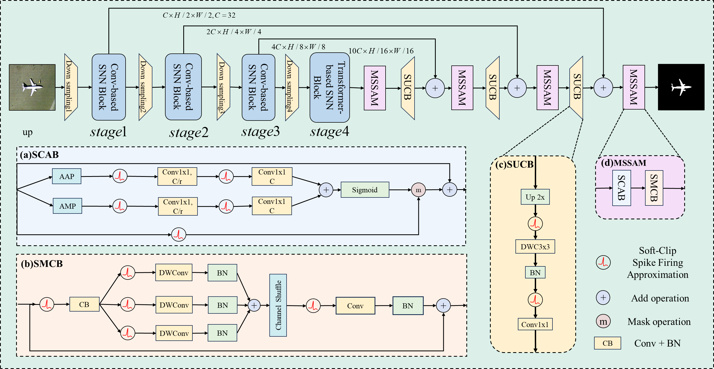

### LENS-Net: Low-Energy Spiking Neural Network for Remote Sensing Saliency
### Abstract
Salient object detection in optical remote sensing images (ORSI-SOD) is vital for applications such as urban planning and disaster monitoring. Yet, existing deep models remain energy-intensive and unsuitable for edge deployment. 
We tackle this challenge by proposing  a Low-Energy Spiking Network Neural for Remote Sensing Saliency(LENS-Net), the first fully spiking neural network for ORSI-SOD. LENS-Net employs a Spike-driven Transformer v3 encoder to extract multi-scale features with low energy cost, and a Spike Multi-scale Attention Decoder that fuses contextual cues via spike-driven channel attention and up-convolution, ensuring effective saliency representation under sparse computation. 
Moreover, a {sigmoid-based soft surrogate gradient} replaces hard truncation, stabilizing training and enhancing boundary recognition in complex scenes. 
Across three benchmark datasets (ORSSD, EORSSD, and ORI-4199), LENS-Net demonstrates outstanding performance while maintaining high energy efficiency, outperforming all lightweight ANN counterparts. For instance, on the ORSSD dataset under a timestep T=4 during inference, it achieves a $S_{\alpha}$ of 92.79\%, an $MAE$ of 0.0109, and consumes only 11.48 mJ of energy. These results establish an efficient, low-energy solution for practical ORSI-SOD deployment.
The source code is available at https://github.com/7dra/LENS-Net.


### Training process
```bash
python train.py
```
### Testing process
```bash
python inference.py
python metric.py
```
